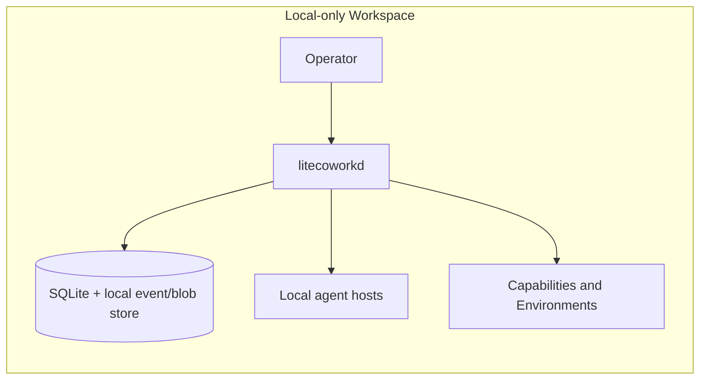
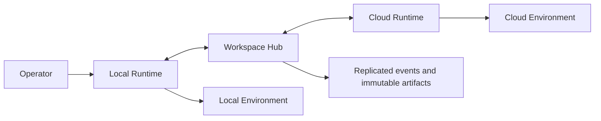
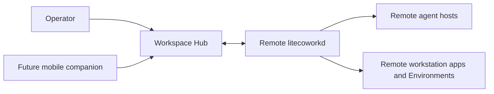

# LiteCowork Architecture

**Status:** vNext target architecture. This file is the current system authority.
Supporting documents may add detail but must not contradict it. Decision records in
`docs/adr/` explain why a boundary exists; they do not silently amend this contract.
The former `ARCH/` corpus is preserved locally under the ignored `archives_docs/` tree
for historical reference only.

## 1. Product definition

LiteCowork is a **durable execution workspace around external agents**. Its central object is
the user's durable Task, not a model, agent, browser, computer, MCP server, or device.

```text
User intent → Conversation → durable Task
             → Agent(s) + Capability(s) + Runtime(s) + Environment(s)
             → Attempts → Effects and Artifacts → Evidence and Verification → Outcome
```

A compatible agent can be a worker; capabilities can be discovered and activated as
needed; any LiteCowork Runtime can host an Attempt; compatible environments can be
selected for that Attempt; and other agents can collaborate. None of these owns the
user's Task.

## 2. Load-bearing invariants

1. **Task truth survives replaceable workers.** A Task is durable; an AgentSession and
   an Attempt are replaceable. Correctness never depends on preserving a private agent
   transcript or teleporting a live process.
2. **External agents own reasoning.** LiteCowork stores and presents plans, checks
   structure and policy, and coordinates execution. It does not provide a second
   reasoning loop, planner, or hidden Goal Keeper.
3. **Keep identities distinct.** Conversation, Task, Step, Attempt, Agent, AgentSession,
   Runtime, Environment, CapabilityInvocation, Capability, Resource, DependencyEdge,
   InvalidationRecord, Effect, Artifact, Evidence, and ExecutionLease are separate
   concepts with separate owners.
4. **Govern only mediated effects.** Core Trust, authorization tickets, audit, and
   verification govern calls routed through LiteCowork. An agent's native tools and
   effects remain under that agent's policy and carry reported or observed provenance;
   LiteCowork must not claim a Core receipt for them.
5. **Discover progressively.** Workers receive a small LiteCowork Gateway surface and
   discover only the capability or skill needed. An installed catalog is not a grant.
6. **Replicate domain truth, not databases.** Runtimes exchange versioned domain events,
   immutable artifacts, resource manifests, and fenced ownership. They do not sync
   SQLite files or copy arbitrary agent state.
7. **Prefer structured operations.** Core-mediated API and protocol operations precede
   browser or OS accessibility where suitable. Native agent tools remain the agent's
   choice and are identified honestly.
8. **Completion requires evidence.** Worker self-report is a proposal. Completion is
   determined from required outputs, effect reconciliation, approvals, and acceptance
   evidence.
9. **Direct attachment cannot bypass Core guarantees.** Use direct capability tools only
   when the provider can enforce the scoped grant and every control required by that
   operation: Effect recording for consequential calls, idempotency where retry safety
   depends on it, and fencing for mediated mutations. Read-only calls do not require an
   Effect. Otherwise route calls through the LiteCowork Gateway.
10. **Operator, Runtime, and workers have independent lifecycles.** The desktop/web/mobile
    Operator can disappear without stopping `litecoworkd`; the Runtime can remain alive
    while agents, local capability processes, Environments, and desktop applications are
    stopped. Workers start only for admitted work or an explicitly configured shared
    service. Installation or discovery never implies a running process.
11. **Runtime recovery is incarnation-scoped.** A stable Runtime identity survives daemon
    restarts, but every daemon start creates a new RuntimeIncarnation. Process handles,
    provider handles, observations, and temporary Environments from an earlier incarnation
    must be revalidated before reuse.
12. **Triggers do not own execution.** An Automation TriggerHost records a durable
    occurrence; ordinary Task admission independently chooses an eligible execution
    Runtime. A due occurrence may wait for a local Runtime or another dependency. Each
    AutomationOccurrence has its own monotonic aggregate `version`; `claim_epoch` is only
    claim fencing and must never serve as the aggregate/event revision. An owner-issued
    ManualTrigger may create one occurrence while an Automation is PAUSED, but it never
    enables recurring trigger hosting.
13. **Opaque provider continuation data stays Runtime-local.** MCP task IDs, provider
    cursors, user-input request keys, and native session/process handles are stored only
    in encrypted local bindings. Their ciphertext digests are local integrity values;
    they are not provider-handle identifiers or recovery tokens. The shared
    `AutomationCursor.cursor_digest` is the one explicit exception: it commits to the
    encrypted cursor bytes for host-epoch consistency, but never reveals or recovers the
    provider cursor. Domain events, Mesh replication, Operator projections, aggregate
    snapshots, and Workspace backups never contain the opaque plaintext values.
14. **Native agents remain themselves.** LiteCowork does not rewrite a harness's native
    configuration or claim ownership of its private subagents, prompts, memory, tools, or
    effects. Unsupported session options fail explicitly; they are never silently
    replaced.
15. **Runtime identity is installation-scoped; Workspace authorization is explicit.** A
    stable Runtime identifies one `litecoworkd` installation, not one Workspace. Each
    authorized Workspace has an independently revocable `RuntimeWorkspaceBinding`.
    Operator API readiness, Runtime execution readiness, and authenticated Mesh
    registration are separate facts. Workspace-scoped Runtime use also checks the
    binding role required for that operation. SQLite's v4 schema removes the historical
    Runtime-to-Workspace column and guards Workspace-scoped Runtime tables through active
    bindings; this does not itself register or enroll a Runtime.
15. **Host delegation is a Core-owned Attempt.** A delegated child targets a Step in an
    already accepted immutable PlanRevision. Every child receives a new AgentSession,
    lease, child-scoped grant evaluation, budget admission, and verification path, plus an
    Environment attachment admitted under its sharing and isolation policy.
16. **Worker eligibility is explicit.** Discovery, binding authorization, lead eligibility,
    and enabled DelegationProfiles are separate. No installed agent is silently exposed
    to a lead or selected as a fallback.
17. **Authority does not flow down the delegation tree.** A child receives newly checked
    Attempt-scoped grants. Parent grants, approvals, SecretLeases, and native tool access
    are never inherited.
18. **Warmth is operational only.** Warm processes, sessions, Environments, browsers,
    capabilities, and local model backends have separate owners and lifetimes. Warmth
    never stands in for Task state, authorization, fencing, or provider cache guarantees.
19. **Coworker identity and Goals organize work.** They may supply defaults and context,
    but they do not own execution or issue authority. Suggestions require an explicit
    user action before they create work or reusable definitions. TASK acceptance commits
    the READY Task and terminal Suggestion together and returns a bounded receipt proving
    their Workspace-scoped link; idempotent replay returns the original commit receipt.
20. **Unknown remains unknown.** Unknown cost, quota, progress, or provider readiness is
    never displayed or ranked as zero, exhausted, complete, or ready without evidence.
21. **Lead failover is versioned Task policy.** A Coworker may supply a default, but each
    TaskSpecRevision pins the effective policy. A lead change rechecks eligibility and
    creates a fresh session/handoff; it never transfers authority or rewrites Attempts.
22. **Coworker-owned schedules pin Coworker revisions.** AutomationRevision may identify
    the Coworker defaults used to materialize an occurrence Task. Current Coworker status
    still fences new scheduled admission.
23. **Execution provenance is Core-recorded.** A consequential Effect links one exact
    CapabilityInvocation and the method used. Unknown method remains explicit; ActionBatch
    groups member Invocations but never makes their Effects transactional.
24. **Personal context remains Resource-backed and revocable.** Core controls retrieval
    eligibility and deletion of owned replicas. The accepted target is quiet,
    automatic, scoped learning with versioned candidate provenance and eligibility
    policy, not an independent model runtime. The current implementation remains
    owner-authored-only until candidate extraction/admission is qualified.
25. **Presentation is a projection, not product truth.** Typed Operator items and transient
    stream frames are derived from authorized domain projections and bounded Agent output.
    They cannot create or settle domain state, carry authority, or replace persisted
    ConversationMessages, Task records, Artifacts, Approvals, Effects, or Evidence.
26. **Conversation messages remain semantic truth.** An optional immutable `RichPresentation`
    may improve how a committed ConversationMessage is rendered, but no fact, citation,
    warning, deliverable, action, or system state may exist only in that presentation.
    Semantic content is committed and usable without waiting for compilation or rendering.
27. **Presentation guidance has no authority.** Built-in `HostSkill` guidance is
    versioned, optional, zero-authority context. It is not a LiteSPM package,
    `CapabilityRef`, grant, activation, or execution policy. Agents may propose bounded
    presentation intent; Core binds real Artifacts, Resources, citations, and system
    projections and rejects forged host-owned state.
28. **Native Task execution requires qualified OS containment.** A working directory or
    Git worktree is not a sandbox. The selected Environment provider must enforce exact
    readable/writable roots, the requested network policy, and process-tree fencing on
    the current OS/Runtime incarnation. Unknown or unsupported containment blocks native
    Agent dispatch and replacement writers; prompt rules, harness permissions, and parent
    process exit are not containment or quiescence evidence.

## 3. Canonical concepts and ownership

| Concept | Meaning and owner |
|---|---|
| Workspace | User-owned durable boundary for Conversations, Tasks, policy, and replication scope. |
| Conversation | User-visible exchange across surfaces. An ordinary question need not create a Task. |
| AgentSession | Scoped external-agent interaction: conversation, task planning, or one Attempt. |
| Task | Durable outcome the user wants, owned by the Task Runtime. |
| TaskSpecRevision | Immutable revision of objective, constraints, outputs, criteria, approvals, and budget. |
| PlanRevision | Agent-proposed, versioned plan stored by Core; Core validates shape and policy but does not invent strategy. Promotion and Step materialization commit atomically. |
| Step | Semantic unit from the current plan. |
| Attempt | One worker's execution of one Step, admitted and tracked by the Task Runtime. |
| AgentProfile / AgentBinding | Discovered agent and its negotiated host binding, owned by Agent Fabric. |
| DelegationProfile / revision | User-enabled worker configuration pinned by a host-delegated Attempt. |
| Coworker / revision | User-facing identity and operating preferences; it does not own Task execution. |
| Goal / revision | User-authored desired outcome; progress is a projection over verified work. |
| Suggestion | Expiring proposal with provenance; it cannot execute or authorize itself. |
| PresentationItem | Ephemeral typed Operator read model sourced from authorized projections; it is not durable domain state. |
| RichPresentation | Immutable optional rendering enhancement bound to one committed ConversationMessage and its semantic-content digest. |
| HostSkill | Bundled immutable guidance asset with no capability, authority, network, or secret access. |
| PresentationIntent | Turn-bound, bounded Agent proposal describing a useful layout; never a trusted system projection. |
| AgentSession | Agent-specific reasoning session; optional native session handles are optimizations, not Task truth. |
| Runtime | A running `litecoworkd` instance, with identity, role, presence, and resource offers. |
| RuntimeIncarnation | One daemon process lifetime under a persistent Runtime identity; process-bound state is scoped to it. |
| AgentHostInstance | Runtime-operational endpoint/process attachment created or attached lazily for AgentSessions; it is not Task truth. |
| Environment | The actual place an Attempt acts: local workspace, worktree, container, VM, browser, desktop, or remote sandbox. |
| Routine / RoutineRevision | Immutable reusable work definition; a Routine run materializes an ordinary Task. |
| TriggerHost | Runtime/provider placement that observes one Automation trigger and creates its occurrence; separate from Task execution placement. |
| ChannelHostAssignment | One fenced Runtime assignment for a ChannelBinding's inbound processing and outbound delivery; RuntimeMesh owns its host epoch. |
| CapabilityRef | Internal normalized identity for a package component or MCP Skill, pinned by its exact content/manifest digest. |
| CapabilityInvocation | Durable lifecycle for one capability operation; it may be read-only, asynchronous, or linked to an Effect. |
| CapabilityGrant | Conversation, planning, or Attempt-scoped authorization for an exact capability and operation; Conversation/planning grants are read-only. |
| Resource / ResourceLocation | Stable logical identity and one independently available location/revision observation. |
| World Index | Facts-only index of explicitly selected Workspace resources, locations, relations, freshness, and deterministic search. |
| ExecutionLease | Fenced authority for one Runtime to own an Attempt at a particular epoch. |
| Effect | A proposed or executed real-world consequence with reconciliation state. |
| Artifact / ArtifactVersion | Durable output identity, immutable content version, storage reference, and provenance. |
| Evidence | References and observations that support a claim about an Effect or acceptance criterion. |

The portable Task checkpoint is the recovery source of truth. Agent session snapshots
and environment snapshots may accelerate resume but are never required for correctness.

## 4. Core and adapter boundary

### LiteCowork Core owns

- Workspace ownership, lifecycle, and replication policy; Conversation identity and the durable Task model: revisions, plan/step projection,
  Attempts, scheduling admission, budgets, cancellation, and ResumePackets.
- Agent Fabric contracts and host-created delegation lifecycle, without taking over an
  agent's internal subagent system or reasoning.
- LiteCowork Capability Gateway, CapabilityBroker, CapabilityHostSupervisor, scoped grants,
  activations, local host bindings, and LiteSPM client integration.
- Runtime identity, pairing, presence, event/artifact replication, execution and channel
  host assignments/leases, fencing, handoff, and failover coordination.
- EnvironmentProvider contract and Attempt placement, not domain-specific intelligence.
- Trust decisions, approvals, secret references/leases, and audit for Core-mediated
  calls.
- Durable event journal, Artifact/Effect/Evidence records, verification orchestration,
  Routine/Automation trigger-to-Task creation, notifications, Runtime lifecycle/recovery,
  dependency preparation, and operator projections/API.

Workspace replication policy selects resources eligible for replication; it never grants capabilities or secrets. Policy changes affect future transfers and do not silently erase copies already present on another Runtime. Archived Workspaces are read-only: they retain authorized reads but reject domain mutations.

These responsibilities may start as a modular monolith. They are not a mandate to
create a network of internal microservices or dozens of crates before a vertical slice
works.

### Capability/provider territory

Office operations, browser automation, computer-use reasoning, coding intelligence,
semantic RAG, connectors, cognitive memory, model routing, workflow engines, and
domain-specific research are not first-party Core domains. They may be provided by an
external agent, MCP server, skill, plugin, connector, environment provider, or other
compatible service. The first-party World Index is a bounded factual substrate over
explicit WorkspaceRoots: stable Resource identity, ResourceLocations, observed revisions,
freshness, structural relationships, and deterministic metadata/text search. It does not
scan the whole machine, infer semantic knowledge, or act as a reasoning model. Removing
an external domain capability should remove that category of work, not break Task
durability or runtime coordination.

### LiteSPM is independent

LiteSPM owns package ecosystem truth and lifecycle. LiteCowork owns only session-scoped
references, grants, activations, and offers (with Task capability locks for durable
Tasks). A listing is not trusted code, an installed
package, an account connection, or an authorization grant. The selected LiteSPM service
base URL is `https://litepsm.sarveshbh-2022.workers.dev/`. Its API, authentication,
manifest, package taxonomy, and install/activation contract remain owned by LiteSPM and
are deliberately not specified here.

## 5. LiteCowork Capability Gateway

Every controlled worker receives one small permanent MCP gateway, not the entire
installed tool inventory. The initial primitive family is:

```text
litecowork.capabilities.search / describe / activate / invoke / list_active
litecowork.skills.search / load
litecowork.agents.search / delegate / status / message / cancel
litecowork.task.read / update_plan / finish
litecowork.artifacts.read / publish
litecowork.user.ask
```

Simple Conversation uses the same Agent Fabric through a `CONVERSATION`-scoped session.
Its Gateway credential is short-lived and limited to that session, Conversation, and
read-only methods. Task planning and Attempt execution use distinct session scopes and
credentials. A Conversation-only session cannot mutate a Task or invoke a consequential
capability.

Resolve package-component versions/digests through LiteSPM; resolve MCP Skills by their
authenticated server identity, exact `SKILL.md` URI, and manifest digest. Check binding
compatibility, scope, policy, and budget, then create a grant matching the session scope.
Direct attachment is allowed only when the provider can enforce the scoped grant and the
controls required by that operation. Consequential calls require Effect recording;
mutations require fencing; operations whose retry safety depends on it require
idempotency. Read-only calls do not require an Effect. Route calls through the Gateway
when required guarantees cannot be enforced on the direct path. If attachment can change
only at a session boundary, use the proxy for the current turn and attach natively at the
next safe boundary. Never rewrite a discovered agent's private configuration or copy host
skills into its native directories.

## 6. Operator, Runtime, worker, and Environment lifecycles

The Operator, `litecoworkd`, and worker/service processes are independent lifecycle
owners. A user may close the main window while the configured Runtime continues; the
Runtime does not start all discovered agents, MCP servers, browsers, Office apps, or
Environments at boot. Runtime boot performs storage/migration/journal recovery, lease and
Effect reconciliation, scheduler/cursor recovery, watcher resumption, and offer refresh
before it advertises readiness. OS service managers start a headless Runtime according to
`MANUAL`, `LOGIN_BACKGROUND`, or `ALWAYS_ON_SERVICE`; they do not start user Automations.

Every daemon restart creates a new RuntimeIncarnation. Offers and process-bound handles
are incarnation-scoped and must be revalidated after restart or wake. Agent hosts start on
the first admitted Conversation turn, planning session, or Attempt that needs them; a
locally spawned host can stop after its references settle and its idle TTL expires.
AgentSession stores only durable scope, selected endpoint, Runtime, incarnation, and
lifecycle. A turn/assignment/session that settles or durably waits closes its session and
releases the host-use reference; the next interaction uses a bounded projection from
durable Conversation/Task state. Its native resume handle and host binding are Runtime-local
and never travel in event state or Workspace backups; continuing on another Runtime creates
a new session.
One installation-scoped Runtime may be authorized for multiple Workspaces. The explicit
`RuntimeWorkspaceBinding` scopes local Workspace operations and Mesh pairing; a RuntimeId
alone never authorizes Workspace access. Local enrollment does not imply cloud pairing.
See ADR-0020 and `RUNTIME-MESH.md`.
Explicitly configured shared daemons are allowed, but no installed agent is kept hot by
default. Model/agent selection changes affect future sessions or planning assignments;
already admitted Attempts remain pinned. Apps launch only when a selected Environment
requires them, and cleanup may close only an instance LiteCowork launched and owns.

LiteSPM owns package/provider process execution and lifecycle: launch/stop, provider-level
isolation implementation, health/restart, and global process reference counting. LiteCowork
owns a normalized Runtime-local `CapabilityHostInstance` view and derives use counts by
joining local `CapabilityActivationHostBinding` records to durable scoped Activations. The
binding and its opaque provider handle never enter replicated event state or Workspace
backups. `CapabilityHostSupervisor` coordinates readiness and releases LiteCowork's use
references through the future LiteSPM adapter contract; it never controls package internals
or duplicates the process supervisor.
Sharing requires declared safe concurrency, a matching pinned capability/configuration,
and the same Trust isolation partition. Each call retains its own grant/fence/effect checks.
Persistent Environments may outlive Tasks only through an explicit Workspace-scoped
lifetime and retention/cost/security policy. `ExecutionDependencyPlan` is a short-lived
preparation projection, not an agent plan or workflow. Agent, provider, Environment, and
application readiness are separate projections; an installed or configured dependency is
not running.

See [`docs/RUNTIME-LIFECYCLE.md`](docs/RUNTIME-LIFECYCLE.md) for boot, drain, sleep/wake,
lazy hosts, and application ownership; [`docs/ROUTINES.md`](docs/ROUTINES.md) and
[`docs/AUTOMATION.md`](docs/AUTOMATION.md) for reusable work and triggers; and
[`docs/COMPETITIVE-RESEARCH.md`](docs/COMPETITIVE-RESEARCH.md) for the dated external
product evidence behind these choices.

## 7. Agent, Runtime, and Environment fabrics

### Agent Fabric

Negotiate features per binding; never infer support from an agent's name. The adapter
surface covers discovery/probe, authentication where supported, session start/resume,
send/steer/interrupt/cancel, capability/context attachment, event streaming, optional
snapshot, and close. AgentProfile identifies agent software; one profile may expose
multiple AgentEndpoints. Choose an endpoint by topology and required features: ACP for an
interactive local/client-to-agent session, A2A for an independent remote agent system,
vendor SDK/API for richer supported integration, and structured CLI/terminal only as a
qualified fallback. Do not apply one global protocol ranking.

The lead agent proposes decomposition and worker choice. It first creates or revises an
ordinary PlanRevision. Core accepts that plan, then checks worker eligibility, permissions,
placement, isolation, budget, concurrency, depth, and deadline for a READY Step before
creating a child Attempt. Native subagents stay agent-owned and are only observed when
the agent reports them; host delegation creates durable LiteCowork Attempts. See
[`docs/DELEGATION.md`](docs/DELEGATION.md).

Simple chat has a Conversation-scoped AgentSession and no Task. Task planning sessions
require a Task but no Attempt; execution sessions require the exact Attempt, active
lease, Environment, and grants.

### LiteCowork Runtime and Mesh

`litecoworkd` is headless and uses the same contracts on a workstation, home server,
VPS, container, or managed cloud. A Runtime may provide workspace-hub, executor,
resource-node, channel-host, trigger-host, and operator-endpoint roles. A standalone
install combines the roles it needs. The Workspace Hub coordinates ownership and
durable state; it is not an AI reasoning service and need not perform all execution.

The Mesh provides runtime identity/pairing, presence, domain-event and artifact
replication, inventory, execution leases/fencing, channel-host assignments, remote
invocation, handoff/failover, and channel availability. Each active ChannelBinding has one
current ChannelHostAssignment; host epoch and bounded lease fence inbound event claims and
outbound delivery. Runtime-local reply references are never copied during reassignment.
One authoritative Hub is sufficient for an individual workspace in the initial system;
do not build consensus/HA algorithms without a demonstrated need.

### Supported deployment shapes



Local-only is the first supported shape. It needs no cloud account or replication and
keeps selected resources on the local Runtime according to Workspace policy.



Local-plus-cloud replication transfers only policy-eligible domain events, Resources,
Artifacts, and portable checkpoint content. Continuation reconciles Effects and fences
the old lease before admitting a new Attempt and AgentSession on another Runtime. A live
process, native session, or provider handle never migrates.



A remote workstation is an ordinary Runtime offering its local agents, applications,
and Environments through the Mesh. A mobile Operator can later be a control client for
Conversations, Needs You, Task steering, approvals, notifications, and Artifacts; it is not part of the desktop-first V1
release. Heavy execution remains on a desktop, cloud, or remote Runtime. All V1 shapes use
the same Task, Effect, Evidence, authorization, and fencing contracts. Offline clients show
the last known state and queue only explicitly supported versioned user intents.

### Environment Fabric

Runtime means the LiteCowork daemon. Environment means the execution substrate. A
Runtime can host or reach multiple Environments. Providers expose probe, create, attach,
execute, resource exposure, optional checkpoint/restore, and destroy operations. Initial
provider candidates include local workspace, Git worktree, container, VM, remote machine,
cloud sandbox, browser, and desktop. Only qualified providers are advertised as
available.
For desktop/local V1, `LocalWorkspace` and `GitWorktree` describe placement/change
semantics, not a security boundary. Native Agent execution requires an OS-qualified
`IsolationAttestation` for exact pinned inputs and declared output roots, plus a
provider-owned process-tree quiescence observation before a writer fence is released.
Provider handles and attestations remain Runtime-local and are revalidated after restart;
an unqualified OS/provider pair remains unavailable for Task dispatch.

## 8. Durable state, resources, events, and replication

Workspace context includes immutable `WorkspaceInstructionRevision` records. Each Task
pins the instruction revision used at creation; later instruction edits affect a Task
only through an explicit TaskSpecRevision. WorkspaceRoots are persistent, user-selected
resource relationships. A one-time folder attachment does not create a root or enable
ongoing indexing.

Resource identity is independent of location. The World Index stores stable Resources,
revision observations, locations on local/cloud/connected providers, relationships, and
freshness. First-party deterministic local-resource search consumes no model tokens and
is limited to authorized roots. Semantic RAG, web search, and cross-document reasoning
remain external capabilities. Resource resolution and inventory inform placement before
cloud execution is considered. ArtifactVersion and VerificationRun input ResourceRefs pin
the exact consumed revisions. Core maintains a rebuildable DependencyEdge reverse index
and append-only InvalidationRecords so changed inputs mark dependent outputs/evidence stale
without rewriting historical artifacts or verification results.

The event journal is the durable change history for Workspaces, Conversations, Tasks, plans, Steps,
Attempts, Effects, approvals, Artifacts, leases, and Runtime presence. Events carry a
stable event ID, workspace/entity identity, origin Runtime and sequence, mandatory entity
revision, logical timestamp, correlation/causation IDs, schema version, type, and typed
payload. Each event also references an immutable content-addressed `AggregateStateRef`
for the complete post-transition aggregate record at that revision. The referenced blob
is transferred and verified before an event is applied or acknowledged. Use a Hybrid
Logical Clock or equivalent ordering scheme across Runtimes.

JSON digests use RFC 8785 canonicalization. The owning Runtime serializes event sequence
allocation with the aggregate/event commit and retains the allocator independently of
event compaction; a failed transaction advances neither the aggregate nor its sequence.
Local blob encryption keys are supplied by a Runtime key provider and are never stored in
the database or domain state. Missing keys fail closed; a plaintext fallback is forbidden.

Replicate domain events, immutable artifacts, resource identity/location manifests, Task revisions,
capability locks, and execution ownership. Do not replicate live database files. Local
SQLite plus local content-addressed storage is suitable for a standalone Runtime; storage
adapters can later use Postgres and S3-compatible blobs without changing domain
contracts. Never put token deltas, video frames, mouse animation, terminal byte streams,
or raw screenshots into the durable journal. Native private prompts, transcripts,
credentials, and agent memory are not synchronized by default.

Frontend event streams are projections over domain truth, not the domain log. The UI
protocol can be replaced independently of the durable event model.

## 9. Continuation, leases, and effects

Cloud continuation is a property of the runtime model, not a special Environment Fabric
feature. A live process normally cannot move between machines. When ownership changes,
the Task advances through a new Attempt:

```text
local Attempt → safe checkpoint → reconcile open Effects → release/expire lease
             → cloud obtains next fencing epoch → new Attempt from ResumePacket
```

An ExecutionLease identifies Task, Step, Attempt, Runtime, epoch/fencing token, expiry,
and checkpoint. Every mediated mutation checks the current epoch. An old Runtime's stale
Core calls are rejected. A fence cannot stop an agent's own unfenced native tools, so
automatic failover is allowed only when the Task's effects and environment make it safe.

Each capability operation has a durable CapabilityInvocation, whether read-only,
long-running, streaming, or consequential. An Invocation may reference a provider task
through an encrypted Runtime-local provider binding and may reference an Effect when the
operation has a real-world consequence. Shared Invocation state contains only normalized
provider status and safe timing/digest/result-reference observations.
MCP Tasks are provider-operation handles mapped to CapabilityInvocation; they are never
LiteCowork Tasks. Each Effect records the operation/target, Attempt, idempotency identity where available,
request digest, lifecycle state, result reference, observed post-state, and verification
reference. States include proposed, started, acknowledged, observed, verified, failed,
and ambiguous. After a crash, reconcile an ambiguous Effect before retrying; never repeat
a non-idempotent action merely because its response was lost.

A nonterminal CapabilityInvocation retains its scoped Activation/provider-host use after
the AgentSession closes. Provider input responses use a Runtime-local exact-key outbox and
are delivered only after the original ConversationTurn or current Task planner/Attempt
reacquires valid authority. An Attempt-bound provider task never migrates to a replacement
Attempt or Runtime; reconcile/cancel it before new work consumes the saved response.

Continuation classes:

- **SAFE_PORTABLE:** consequential effects are mediated/fenced or contained in a
  disposable isolated Environment; automatic continuation can be allowed.
- **REPLAYABLE:** operations are read-only or provably idempotent; reconcile first, then
  a new Attempt may run.
- **HANDOFF_REQUIRED:** native or otherwise unfenced side effects require explicit
  handoff or user review.
- **LOCAL_BOUND:** work needs an unavailable local resource and waits for that Runtime.

Cloud eligibility also checks required inputs, agent and capability availability,
secret placement, environment reproducibility, unresolved Effects, policy, and budget.

## 10. Artifacts, evidence, and completion

Artifacts are first-party durable records. Each ArtifactVersion pins either a managed blob
(digest and BlobStore reference) or an external Resource/provider revision (optional
observed digest, without a required local blob). It records creator Attempt, input
references, provenance, verification references, and creation time. Providers create or
edit content; Core owns version identity and provenance. Library is a user-facing
projection, and saving or publishing is explicit.

Evidence distinguishes:

- **REPORTED:** a worker claims an action or result.
- **OBSERVED:** LiteCowork or a provider saw a response or state change.
- **VERIFIED:** a suitable independent check confirmed the required postcondition.

Prefer deterministic checks (schema, hash, tests, provider reconciliation, structured
postconditions); use semantic/model review only when criteria require judgment. A worker
calling `litecowork.task.finish` proposes completion. The Task Runtime checks required
outputs, active children, approvals, ambiguous Effects, and acceptance evidence before
marking the Task complete. Other outcomes include verifying, needs-user, incomplete, and
blocked.

## 11. Protocol boundaries

Keep these protocols separate:

1. **Operator:** desktop/web/mobile/CLI to `litecoworkd`.
2. **Mesh:** Runtime to Runtime identity, sync, presence, leases, and remote invocation.
3. **Agent:** Runtime to external agent over ACP, A2A, SDK/API, or CLI adapter.
4. **Capability:** Agent to LiteCowork Gateway MCP, Broker, LiteSPM, or provider.
5. **Environment:** Attempt to EnvironmentProvider.
6. **Human channels:** Telegram, Slack, Discord, Teams, email, and webhook adapters feed
   authenticated messages into the same Conversation/Task model; they do not own a
   separate bot task store. Each binding has one fenced ChannelHost Runtime; losing that
   host blocks new channel work until a new lease/epoch is committed.

Channel assurance determines whether an identity may view, steer, or approve sensitive
work. A weakly authenticated channel cannot approve high-risk actions.

## 12. User experience

Primary navigation is New session/Conversations, optional Coworkers, Needs You, Work, Automations, Library, and Discover, with
recent Conversations in the persistent sidebar. One composer handles quick questions and
durable tasks; no Chat/Cowork/Agent mode switch is required. Sending can explicitly
materialize a Task, save a Routine, or schedule a Routine; durable Automation creation
requires review/confirmation. Advanced Agent, Model, Run location, Tools, budget, and
access controls are progressive disclosures. Runtime start/stop controls are separate
from closing the Operator window.

Live Desk shows actual Task/Step/Attempt state, real capability use, Runtime placement,
artifacts, verification, and blocked/needs-user state. It must not invent agent activity,
fake third-party interfaces, imply that a process teleported, or show verification before
a verifier ran. Reduced-motion support preserves the same state transitions.

Conversation rendering preserves two distinct layers: the committed semantic
ConversationMessage and an optional immutable RichPresentation enhancement. The message
is rendered immediately and remains complete for search, export, channels, old clients,
and renderer/blob failure. Rich blocks can only bind exact semantic slices, authorized
Resource/Artifact refs, registered tool results, or trusted Core projections; generated
presentation cannot create system state or authority. Built-in response-design HostSkills
are optional zero-authority context, not LiteSPM capabilities. See
[`docs/RICH-RESPONSE.md`](docs/RICH-RESPONSE.md),
[`docs/PRESENTATION-RUNTIME.md`](docs/PRESENTATION-RUNTIME.md), and
[`docs/HOST-GUIDANCE.md`](docs/HOST-GUIDANCE.md).

## 13. Explicitly outside first-party Core

Do not recreate first-party model routing, cognitive memory/vector retrieval, a universal
reasoning World Model, Office implementation, browser/computer-use intelligence, code
intelligence, semantic/web research engine, connector marketplace, large workflow
runtime, or a massive built-in skill catalog. Integrate these as external agents,
capabilities, LiteSPM packages, or EnvironmentProviders. The bounded factual World Index
and deterministic search over selected Workspace resources remain first-party. Core stays
capable by composing replaceable parts rather than implementing every domain.

## 14. Implementation and release sequence

V1 is the complete **desktop/local product**. Cloud continuation and remote Runtime are
post-V1 releases; they remain supported architectural directions, but they are not V1
acceptance gates. This keeps the V1 goal honest and focused without removing finalized
local capabilities from scope. The first desktop alpha proves a useful local Task; V1 exit
requires the full finalized local feature coverage and production qualification.

1. **Development foundation (G0):** verified toolchain, contract CI, storage/event
   transactions, authenticated Operator boundary, separate Runtime lifecycle, test
   harnesses and recorded language/database/transport qualification.
2. **Local desktop substrate (G1):** Tauri Operator and `litecoworkd`; Workspace,
   Resources/folders, deterministic search, Conversations, TaskSpec/attempt-free planning,
   accepted PlanRevision/Steps, one full-fidelity native harness, Attempt/lease/resume,
   real Trust/Gateway/Evidence/verification and a useful Artifact. Recover after app,
   daemon and agent process interruption.
3. **Complete local product (G2):** delegation profiles and multiple native/host workers,
   cost-aware selection/escalation, file/folder/ZIP parsing and provider-backed RAG,
   qualified local model path, office/data/research providers, browser/computer/control
   leases, environments/warmth/deadline preflight, Coworker/Home/Goals/Suggestions,
   editable context, rich Workbench, accessibility/motion, Routines/Automations,
   Teach-a-task/skills and notification UX. The one qualified human channel is delivered
   notification UX. The complete finalized local coverage matrix and real-user workflows
   pass before V1 production qualification.
4. **V1 production qualification (G3):** real local desktop installers and upgrades,
   local backup/restore and rollback, declared local platform/adapter matrix, all local
   Flows and Benchmarks, local fault injection, accessibility, privacy/security review,
   real-user corpus, measured performance and owner-signed acceptance.
5. **Post-V1 cloud continuation:** deploy the same `litecoworkd` domain contract, persistent
   storage and blob replication, device pairing/revocation, placement/resource policy,
   leases/fencing, portable Task handoff, remote approval/status, backup/restore, cloud
   operations and cost/security recovery, including one qualified human channel gateway.
   No database-file/native-agent-state sync and no live process teleport.
6. **Post-V1 Remote Runtime:** install/enroll the same headless Runtime on a remote host,
   qualify capabilities and Resources, placement, OS service lifecycle, disconnection,
   revocation and continuation against cloud fencing.

Each numbered release gate is decomposed into one-owner-reviewable stories in
[`implementation/ROADMAP.md`](implementation/ROADMAP.md) and
[`implementation/backlog.json`](implementation/backlog.json). Plan assignments and test
IDs are not implementation evidence. Existing Flow/Benchmark IDs and machine-contract
inventories are linked from [`implementation/COVERAGE.md`](implementation/COVERAGE.md).
A release gate remains open while a required provider/capability lacks real qualification;
a fixture proves Core coordination only.

### Recommended initial implementation shape

Use Rust for the modular `litecoworkd` Runtime, domain/application services and native
process/resource supervision; use Tauri 2 with React/strict TypeScript for the desktop
Operator and generated typed API client. Keep the daemon independent from the window
lifecycle. Start as a modular application and introduce crates at demonstrated ownership
seams; do not create empty microservices or every planned crate at once.

Start local persistence with SQLite WAL, foreign keys and the existing transactional
contract, one bounded write executor and immutable local blobs; qualify the driver before
freezing. FTS5 is a candidate for deterministic text search. Parsing/OCR and semantic
retrieval are isolated provider capabilities (a Python parser such as Docling is a
candidate), not Core-owned model/reasoning loops. Local inference uses a qualified native
agent harness backed by an existing engine (Ollama, LM Studio or llama.cpp are candidates),
not a raw completion endpoint presented as an agent. Cloud starts with the same daemon in
a long-lived isolated Linux container/VM, durable volume and backups; add Postgres or
managed orchestration only when measured deployment needs justify them. Pin exact
libraries, versions, target OS matrix and numeric SLOs only after documented qualification
spikes; recommendations and decisions are distinguished in the implementation plan.

See [`docs/IMPLEMENTATION.md`](docs/IMPLEMENTATION.md) for dependency direction and
module ownership, [`docs/TESTING.md`](docs/TESTING.md) for evidence levels, and
[`implementation/STACK.md`](implementation/STACK.md) for stack qualification.

## 15. Contract map and authority

[`docs/COVERAGE-MATRIX.md`](docs/COVERAGE-MATRIX.md) indexes the complete HLD, LLD,
API, persistence, security, UI, motion, operations, and acceptance contracts. Each
concern has one normative document; other documents link to it. The source reconciliation
and dispositions are recorded in [`docs/SOURCE-RECONCILIATION.md`](docs/SOURCE-RECONCILIATION.md).

## 16. Initial implementation ownership map

This is a candidate module layout, not a set of day-one crates or an additional stack
decision. The desktop-first Runtime/UI stack and qualification rules are specified in
section 14 and `implementation/STACK.md`. Ship two distinct local executables: the
headless `litecoworkd` Runtime and the LiteCowork Operator desktop application. The Operator may launch/connect to the daemon,
but it is not the service process. Start as one modular Runtime plus the Operator and a
small set of domain modules. A candidate source layout is:

```text
apps/litecoworkd/                    # headless Runtime/service binary
apps/litecowork-ui/                  # Tauri + React desktop UI and native command bridge
apps/operator-web/                   # future optional client; not V1
crates/domain/{conversation,task,artifact,effect,evidence}/
crates/runtime/{lifecycle,supervisor,attempt_runner,dependency_planner}/
crates/mesh/{identity,presence,replication,leases,transport}/
crates/agents/{adapter,acp,a2a,cli}/
crates/capabilities/{gateway,broker,host_supervisor,litespm_adapter}/
crates/environments/{local,worktree,container,remote}/
crates/{trust,verification,routines,automation,events,storage,operator-api}/
```

This is a starting boundary, not a requirement to create empty modules. Introduce a
module only when a working vertical slice needs it.

## Coworker UX and autonomy vNext authority

The accepted product decision is documented in [Coworker target](docs/COWORKERS-TARGET.md). Ordinary conversations do not require a Coworker. Named Coworkers are chat-first persistent identities; their optional integrated connections and configured responsibilities DO NOT create a new agent harness, execution engine, permissions authority, or hidden planner. A confirmed standing responsibility groups existing Goal/Routine/Automation objects and fences unattended Task admission. Its triggers, execution and verification remain owned by their established services. Connections are unbounded as CONFIGURED inventory, never unbounded live activation. Memory learning is automatically eligible only within a preauthorized source/scope policy; it does not authorize proactive actions. The target record sketches in that document require separate versioned IDL, event and migration implementation before any route or UI action may claim to work. Existing Runtime and Trust restrictions remain mandatory.
