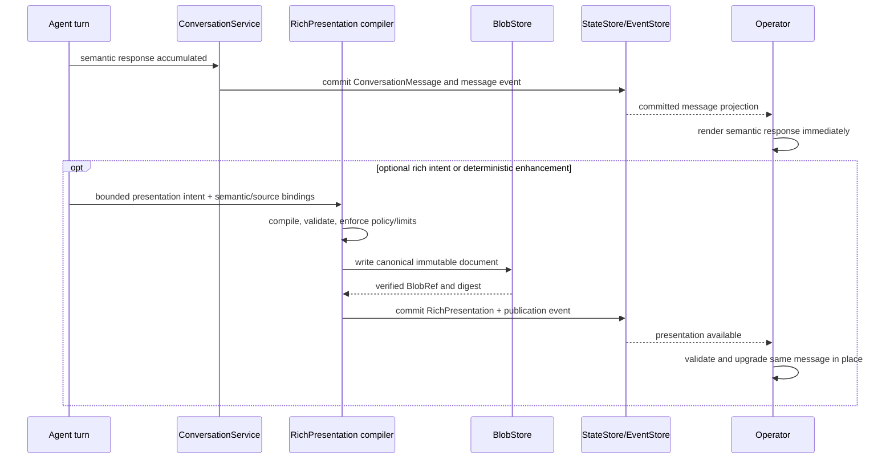

# Presentation Runtime

## Purpose and authority

The Presentation Runtime turns authorized LiteCowork projections and bounded Agent
output into a consistent Operator experience. It is a rendering contract, not another
execution or persistence system.

```text
Conversation / Task / Artifact / Approval / Resource truth
                         │
                         ▼
              authenticated read projection
                         │
                         ▼
                PresentationProjector
                         │
                         ▼
                  PresentationItem
                         │
                         ▼
              Operator RendererRegistry
                         │
                         ▼
                 screen / Workbench
```

The owning domain services remain authoritative for durable state. The Operator may keep
ephemeral rendering state, but it cannot create a Task, resolve an Approval, mark an
Artifact verified, authorize a capability, or claim that an external action succeeded.
Those transitions require their owning commands and committed projections.

The PresentationProjector runs in the Operator/API projection boundary. It reads only
Workspace-authorized projections. RendererRegistry runs in the desktop Operator. Domain
providers own specialized editing behavior; LiteCowork owns the shell, source identity,
version selection, provenance display, and safe fallback behavior.

This document also defines the transport and Operator behavior for optional Rich
Presentations. Rich-response vocabulary and compilation are owned by
[`RICH-RESPONSE.md`](RICH-RESPONSE.md); host-only instruction delivery is owned by
[`HOST-GUIDANCE.md`](HOST-GUIDANCE.md). A `TaskPresentationSnapshot` remains a factual
read projection and is not a `RichPresentation`.

## User model

LiteCowork has one experience for technical and nontechnical users. It does not make users
choose between a simplified product mode and an advanced product mode. The same content
uses progressive disclosure:

1. **Outcome:** answer, decision needed, or finished Artifact.
2. **Activity:** a concise, truthful summary of current work and blockers.
3. **Work detail:** Steps, sources, workers, verification, and Artifact versions.
4. **Inspector:** Attempts, AgentSessions, Runtime/Environment, invocations, Effects,
   Evidence, leases, policy, and sanitized diagnostics.

The first three levels use plain-language labels and actionable next steps. Inspector
preserves technical detail for developers. Opening more detail never changes the Task,
worker, permission, or execution policy.

## PresentationItem value object

`PresentationItem` is an ephemeral/read-model value object. It is not an aggregate, domain
event, Artifact, or independent journal. Persisted ConversationMessages, Task projections,
Artifacts, UserRequests, Approvals, and Resources remain the source of truth.

```text
PresentationItem {
  item_key: string                 # stable within its source projection
  kind: PresentationItemKind
  payload_version: u32
  source_refs: SourceRef[]         # exact authorized source identity/revision
  occurred_at?: Timestamp
  order_key: string                # stable source order, not client arrival order
  status?: PresentationStatus      # display hint; owning domain status remains truth
  label?: string                   # plain-text accessible name
  payload: TypedPresentationPayload
  freshness: CURRENT | STALE | UNKNOWN
}

PresentationStatus =
  IN_PROGRESS | WAITING | NEEDS_USER | COMPLETE | INCOMPLETE |
  FAILED | UNAVAILABLE | UNKNOWN

PresentationItemKind =
  TEXT | ACTIVITY | TASK_CARD | USER_REQUEST | APPROVAL | ARTIFACT |
  CITATION | CODE | DIFF | TABLE | CHART | IMAGE | BROWSER | TERMINAL |
  MCP_APP | ERROR
```

Each kind has a closed, validated payload shape owned by its projection/provider
contract. Arbitrary HTML, script, shell commands, filesystem paths, credentials, provider
session handles, and unbounded binary data are not PresentationItem payloads. Large content
is read through its owning authorized Resource/Artifact/Workbench route. Plain-text and
download fallbacks are required when a renderer is absent or disabled.

Status is a concise rendering hint mapped from the owning record; it is never written back
to that record. A generic `COMPLETE` item cannot mark a Task complete, and only a committed
Verification/Evidence projection can render a verified outcome.

`source_refs` identify the persisted message, projection record, Resource revision,
ArtifactVersion, UserRequest, or Approval that justifies the item. They do not grant access;
the server rechecks access when the source is opened. A renderer must show `UNKNOWN` when
the source cannot establish freshness or provenance.

## Projection and stream contract

The desktop currently also exposes a finite read-only Task snapshot at
`GET /v1/tasks/{task_id}/presentation`. It includes the committed Task card, its current
Plan Steps, and resolvable Artifact versions. SQLite reads these records from one
consistent read transaction, bounded to 100 Steps and 200 Task Artifacts; an over-cap
source set rejects the snapshot rather than returning a partial view. Unresolvable
current ArtifactVersions are omitted. `CURRENT` freshness means only that the included
persisted source records were read from the same SQLite snapshot. It does not assert
worker liveness, progress, verification, or external/provider freshness. This endpoint
is not a substitute for the specified snapshot-plus-stream cursor protocol and does not
contain transient turn text.

The desktop also exposes `GET /v1/tasks/{task_id}/progress` as a separate authenticated,
Workspace-owner-scoped, no-store read. Its current source projection is derived in the
same bounded SQLite snapshot from the Task, current-plan Steps, each Step's persisted
current Attempt, latest committed Task/Step/Attempt events, latest Evidence timestamp,
blockers, and newest resolvable ArtifactVersion. Terminal current Attempts can provide
the latest activity timestamp/source but are excluded from `active_workstreams`; those
contain only nonterminal current Attempts. The implementation does not yet ingest
CapabilityInvocation, provider-progress, or Environment-observation sources, so it does
not claim those are absent or live. Unknown event kinds can supply timestamp/source but
not a human summary. Over-cap source sets fail instead of silently returning a partial
progress view. Progress is a projection and does not mutate Task state.

The authenticated Operator stream remains the transport. Presentation subscriptions use
the same Workspace authentication, opaque resume cursor, resync marker, and projection
version rules defined in `API.md`.

After a valid `Subscribe`, the server sends `stream.ready` with the accepted Workspace,
projection version, initial opaque cursor, and finite `max_frame_bytes`. Presentation
updates carry their source identity, projection revision, and cursor; clients apply them
only after `stream.ready`. A resync-required response invalidates the prior cursor and
requires a fresh snapshot before later frames are accepted.

```text
StreamReadyFrame {
  type: "stream.ready"
  workspace_id: WorkspaceId
  projection_version: u32
  cursor: OpaqueStreamCursor
  max_frame_bytes: u32
}
```

`projection_types` may request `conversation_presentation` and `task_presentation`.
Snapshot reads establish the current projection revision before stream deltas are applied.
Each update carries its source identity, projection revision, and cursor. The client
replaces an older item when the same `item_key` advances to a newer source revision; it
never orders items by network arrival time.

Live assistant text may be sent as bounded, transient frames:

```text
TurnDeltaFrame {
  type: "turn.delta"
  conversation_id: ConversationId
  turn_id: ConversationTurnId
  retry_ordinal: u32             # pins the active ConversationTurn try
  sequence: u64                 # monotonic within (turn_id, retry_ordinal)
  text_delta: string            # coalesced UTF-8 text, never a model-token frame
}
```

These frames:

- are not domain events, replicated data, or a final ConversationMessage;
- are discarded from the durable projection if the turn fails before message commit;
- cannot contain authorization material, SecretStore bytes, native/provider handles, or
  hidden reasoning; normal output safety/redaction policy still applies;
- are reconciled against the committed message after turn settlement;
- are not replayed as new activity after reconnect or historical hydration.

The Operator/API contract advertises a finite maximum frame size and applies backpressure;
agents are not streamed one model token per frame. The UI keeps a bounded partial buffer.
If a sequence gap cannot be replayed by the active adapter, it discards the partial buffer,
shows “Reconnecting response”, and waits for the committed message or a supported replay;
it never concatenates text across an unknown gap.

Turn presentation follows the owning ConversationTurn projection: `STREAMING` while the
turn is active; `COMMITTED` only when its ConversationMessage exists; and `INCOMPLETE` when
the turn ends without a committed response after partial output was shown. These are
rendering states, not new ConversationTurn or ConversationMessage statuses. Retry follows
the existing ConversationTurn retry lifecycle. A new retry ordinal starts a separate
sequence scope and a visibly separate incomplete segment; its text is never appended to
the prior failed partial response.

On reconnect, the Operator first obtains the current authorized Conversation/Task
projection and cursor, then subscribes from that cursor. If the cursor is expired or the
projection version is incompatible, it replaces local state before accepting later
deltas. A transient delta is ignored if its turn is settled or its sequence does not
advance. Duplicate/out-of-order delivery cannot duplicate text. The committed
ConversationMessage supersedes transient text and remains the durable record.

The durable event journal does not store per-token updates, renderer state, scroll
position, panel layout, hover/focus, or animation frames. Domain events drive durable state
and domain motion. Presentation frames are transport-level projection data.

## RichPresentation transport and publication

`ConversationMessage` is semantic truth. A `RichPresentation` is a separate immutable
read enhancement keyed to one committed Agent `ConversationMessage`; it is not embedded
in, or required to read, the message. The semantic answer is committed and exposed first.
Compilation may consume already validated turn output while streaming, but it must never
delay message persistence, turn settlement, or the first readable final response. The
compiler may publish a valid enhancement afterward. Failure, timeout, unsupported schema,
missing blob, or renderer failure leaves the semantic message complete and readable.

The rich aggregate has exactly one version-1 record per message:

```text
RichPresentation {
  presentation_id: PresentationId
  workspace_id: WorkspaceId
  conversation_id: ConversationId
  message_id: MessageId

  schema_version: u32
  renderer_contract_version: u32
  semantic_content_digest: Sha256Digest

  document_ref: BlobRef
  document_digest: Sha256Digest
  document_size_bytes: u64

  producer_agent_session_id?: AgentSessionId
  host_instruction_digest?: Sha256Digest
  host_skill_refs: HostSkillRef[]

  created_at: Timestamp
  version: 1
}
```

The document is canonical JSON using RFC 8785 JCS and a SHA-256 digest. It contains only
bounded typed blocks and references, never binary payloads or executable UI. Its
`semantic_content_digest` binds it to the exact message text projection defined in
`RICH-RESPONSE.md`. The publisher verifies Workspace, Conversation, message role, source
references, digest, size, and unique message binding in one StateStore transaction before
appending `rich.presentation.published.v1`. Message creation and RichPresentation
publication are separate aggregate commits/events: a renderer upgrade can arrive later
and never changes the Message identity or content. A prepared but unreferenced blob after
transaction failure is ordinary garbage-collection input.

`GET /v1/conversations/{conversationId}/presentation` returns an authorized bounded
`ConversationPresentationSnapshot`. The snapshot contains committed message summaries,
available RichPresentation refs, linked trusted projection refs, active-turn state, and
the snapshot projection revision/cursor. It does not embed arbitrary presentation blobs.
`GET /v1/rich-presentations/{presentationId}` authorizes the exact Workspace/message link,
fetches the bounded document, and verifies its digest before returning it. The response
uses `no-store`; clients validate Workspace, Conversation, Message, schema version,
document size, digest, and every host-bound source reference before rendering.

Availability is explicit:

```text
RichPresentationAvailability =
    AVAILABLE
  | FETCHING
  | UNAVAILABLE
  | POLICY_OMITTED
  | UNSUPPORTED_VERSION
  | INTEGRITY_FAILED
```

For every state except `AVAILABLE`, the client renders the committed semantic message.
When the exact immutable document later becomes available, the client upgrades the same
message in place. Historical hydration, reconnect, and backup restore do not replay typing
or entrance animations. Missing RichPresentation data does not make a Conversation
unreadable or unrestorable.

### Durable versus transient frames

The existing `turn.delta` frame remains coalesced semantic text. Optional rich composition
uses `rich.draft` transport frames, never DomainEvents or projection events. Every draft is
bound to `(workspace_id, conversation_id, turn_id, retry_ordinal, agent_session_id,
draft_id)` with monotonically increasing sequence numbers. Frames are accepted only for
the currently active retry/session. Retry, settlement, cancellation, disconnect, and
resync fence old drafts. A draft can be discarded at any time without affecting the
message or turn.

The Operator stream frame union is:

```text
OperatorStreamFrame =
    PROJECTION
  | TURN_DELTA
  | RICH_DRAFT
  | RESYNC_REQUIRED
```

`rich.draft` events are `DRAFT_STARTED`, `BLOCK_OPENED`, `TEXT_APPENDED`,
`BLOCK_REPLACED`, `BLOCK_CLOSED`, `DRAFT_FINALIZING`, `DRAFT_PUBLISHED`, or
`DRAFT_FAILED`. Open-block count, nesting depth, total bytes, frame count, queue bytes,
and block count are bounded. Text fragments are coalesced. A closed block's parent/order
cannot change; corrections append a replacement block. A sequence gap is replayed only
from a bounded draft snapshot when supported. Otherwise the client drops the ephemeral
rich draft and continues with ordinary text/message handling. Slow rendering never blocks
AgentSession reads or turn settlement.

## Conversation snapshot and commit flow



ConversationTurn success is determined by its committed ConversationMessage and existing
turn lifecycle. Optional RichPresentation compilation is not a prerequisite for turn
completion and cannot change Task completion, Effect reconciliation, Verification, or
Artifact state.

## RendererRegistry

```text
RendererRegistry {
  resolve(kind, payload_version, host_capabilities) -> RendererOffer
  render(item, authorized_source_reader) -> View
  fallback(item) -> PlainTextOrDownloadView
}
```

Built-in renderer families:

| Item | Default presentation | Workbench behavior |
|---|---|---|
| TEXT / CITATION | Accessible rich text and source links | Open exact source revision |
| ACTIVITY / TASK_CARD | Plain-language summary and real status | Open Live Desk/Task detail |
| USER_REQUEST / APPROVAL | Dedicated typed card and exact action | Resolve through owning service only |
| ARTIFACT | Type-aware card with version and verification state | Open supported preview/editor; show bounded recent history and, for supported plain text only, prepare an explicitly confirmed restore draft that publishes as a new version |
| CODE / DIFF | Syntax-aware code and reviewable change | Open read-only or provider-owned editor |
| TABLE / CHART / IMAGE | Bounded data/image renderer with text alternative | Open qualified renderer |
| BROWSER / TERMINAL | Explicitly labeled live environment surface | Acquire applicable control/read lease before interaction |
| MCP_APP | Sandboxed, capability-negotiated app surface | Use the separate MCP App security contract |
| ERROR | Safe message, source, recovery action | Open the owning domain's recovery flow |

Renderer selection uses declared item kind/version and Operator capabilities, not
untrusted MIME labels alone. An unsupported renderer produces an explicit fallback; it
does not drop the item or convert it to executable content. A user-disabled renderer
remains disabled after refresh.

Rich-text, code, table, and image renderers treat payloads as untrusted. They do not execute
inline HTML/script, load remote assets implicitly, or navigate `javascript:`, `file:`, or
other disallowed schemes. External navigation follows the Operator's URL confirmation and
egress rules. Approval/UserRequest actions remain in LiteCowork's built-in typed controls;
a plugin renderer cannot substitute an action surface or resolve those records itself.

MCP Apps remain isolated iframe content under `NETWORK-SECURITY.md`, `SECURITY.md`, and
`CAPABILITY-INVOCATIONS.md`. They receive no host DOM, cookies, local storage, filesystem,
or native IPC. Any action returns through the authenticated capability protocol and
existing Trust/effect controls. The frame can request a display mode; the Operator decides
whether inline, panel, or fullscreen is allowed.

## Workbench and Artifact versions

The Workbench is a contextual shell, not a single editor implementation. It preserves the
selected Artifact ID, immutable ArtifactVersion, dirty state, source/provenance, and current
renderer across panel changes. Supported renderers may include documents, spreadsheets,
slides, PDFs, images, code/diffs, tables, browser/terminal environments, and MCP Apps.

Editing belongs to the qualified provider/renderer. Publication calls ArtifactStore with
the expected Artifact aggregate version and creates a new immutable ArtifactVersion and
ResourceRevision. A stale publication preserves the draft and requires explicit rebase or
merge. Closing a dirty view asks whether to keep editing, publish, or discard the local
draft; it never silently publishes or destroys a committed version.

Version history lists immutable versions, author/source, Task, verification state, and
creation time. Compare is offered only when the renderer can compare that content kind.
“Restore this version” republishes the selected prior content as a new current version
after the normal expected-version check; it never moves the current pointer backward or
deletes intervening versions.

Provider loss leaves committed Artifact versions readable wherever local content and a
qualified fallback renderer are available. The UI distinguishes preview unavailable,
content unavailable, and provider unavailable. It never implies that a missing renderer
means the Artifact was deleted.

Current desktop scope is narrower than the target above: the Workbench can edit and
restore only managed UTF-8 `text/plain` content up to 1 MiB. Restore uses the existing
user text-append operation to create a new immutable version after explicit confirmation
and publication; it does not support external content or other media types, and the
current append provenance has no dedicated restored-from relation. Managed Markdown has
a bounded preview-only renderer for headings, paragraphs, simple lists, quotes, fenced
code, inline emphasis/code, and owner-confirmed HTTPS links. It uses React text nodes,
does not execute HTML or load remote images, and falls back to the original text for
unsupported/malformed syntax. It is not a full CommonMark renderer or an editor. Managed
text comparisons also offer a bounded literal line-diff display (400 lines per side,
160,000 line-pairs, and 16,384 characters per line). Larger inputs retain the existing
side-by-side renderer. This diff does not claim semantic change analysis and creates no
Artifact version or other durable state.

## Context-use presentation

Context assembly and authorization are defined in `CONTEXT.md`. The Operator may show a
compact “Context used” disclosure for a Conversation turn or Task planning/execution
projection. It lists only context actually resolved and attached, grouped into explicit
attachments, Workspace/Coworker instructions, selected ContextDocuments, and retrieved
provider sources. Each source opens its authorized exact revision when available.

The collapsed view uses human-readable source names and a short count/summary. Expanded
source details show scope, freshness, retrieval time, and any available exact revision or
digest; opaque identifiers are reserved for Inspector/copy-diagnostics. This keeps ordinary
use legible while preserving technical auditability.

The disclosure must not imply that all available Resources or all past Conversations were
read. It reports retrieval source, scope, revision/digest where available, and freshness
limitations. If a provider cannot identify a source, show that limitation. Revoked or
deleted context is not displayed as currently usable; historical provenance can remain in
the Task Inspector without restoring content. Context inspection is read-only; edits,
revocation, and deletion go through ResourceService.

## Failure and recovery behavior

| Condition | Presentation behavior |
|---|---|
| Projection cursor expired | Replace from a fresh snapshot; no historical animation |
| Late or duplicate delta | Ignore unless turn and monotonic sequence are current |
| Turn fails before message commit | Mark transient response incomplete/failed; do not present it as a saved answer |
| Source revision is stale/conflicted | Label it and open the revision-resolution flow |
| Renderer missing/disabled | Show a safe text/download fallback and exact limitation |
| Permission revoked after a view opened | Stop future reads/actions, clear protected live content, retain authorized provenance only |
| Artifact publication conflict | Preserve the dirty draft and offer compare/rebase; do not overwrite |
| MCP App unavailable/incompatible | Show its ordinary tool/resource result and compatibility explanation |
| Operator offline | Show last projection time and disable authority-requiring actions |

## Verification requirements

Presentation conformance covers stable ordering, reconnect/resync, stale source labels,
duplicate/reordered transient deltas, late terminal frames, renderer fallback,
authorization revocation, dirty Artifact conflicts, and MCP App denial. UI acceptance covers
keyboard-only navigation, screen reader labels/announcements, reduced motion, zoom/reflow,
long content, offline state, and one nontechnical plus one technical owner workflow. A
browser component test does not qualify the Tauri desktop shell or its OS integrations.

## Coworker chat/Workbench and rich results target

A Coworker conversation uses the identical ConversationMessage semantic truth and optional validated RichPresentation contract as ordinary sessions. Running Automations and child Tasks generate concise linked updates under the Coworker and distinct Run timelines; they must not inject whole native agent transcripts into chat history. The right Workbench opens exact committed ArtifactVersions, preserves unsaved edits across Coworker navigation, and shows honest fallback for unsupported editors/preview types. Optional rich blocks cannot implement permissions, approve a connection, start a responsibility, fake Work, store memory or replace authoritative Tasks. All add-connection and confirmation controls are host-owned and attached to real action endpoints only.
